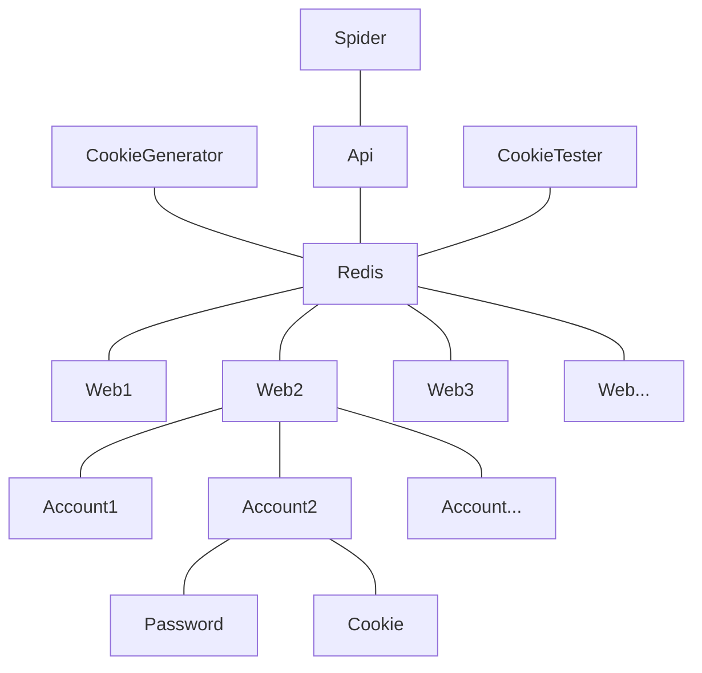

# Cookie池

### 目标和功能

**目标：**

使爬虫更容易获取某些网站的数据，将网站cookies保存到一个地方，可以随时提取使用。

**功能：**

- Cookies自动生成、生成时间间隔、存储
- Cookies自动检测、清理
- Cookies随机提取、提取时间间隔、发放

**结构图：**

---

### 存储模块

如结构图，不同网站对应的账号、cookie肯定不通用，所以需要分块储存。

一个网站对应一个RedisKey，密码和cookie都是与账号相关联，账号与网站相关联，层级关系一目了然，使用RedisHash存储最合适不过。

### 生成模块

找出没有cookie的账号，重新生成有效cookie并存入数据库，供爬虫使用。生成前还需检测时间间隔（比如登录太频繁会导致封号）。

### 检测模块

检测cookie是否还有效，失效了就删除cookie（账号也会一并删除）。

### 接口模块

提供接口供爬虫调用。调用之前测试是否在冷却期。

